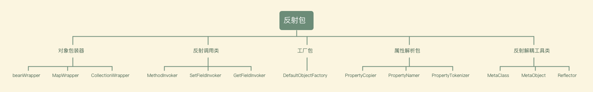

## 反射工具包解决的问题
针对不同的对象提供统一的获取、设置属性值。

通用的对象，它的属性是未知的，可能是一个对象，可能是一个list，可能是一个map，我们要如何给他设置一个值。

对象本身又可以是一个map，是一个list，这种情况下我们又如何去给某个元素设置值,如何去给某个元素的某个属性设置值。

获取也是同理，反射工具包就是为了解决这样的问题的。

## 反射包分类

## 工具包使用流程

工具从MetaObject.forObject()开始,将对象构造成一个MetaObject类。

该类在初始化过程中会将我们传入的对象进行包装，根据对象类型的不同包装成，beanWrapper或者MapWrapper或者ListWrapper

    当我们利用object去构造一个MetaObject时,会根据object去生成对应的包装类，包装类一般包含，object本身，和MetaClass类。
    MeaClass元Class类，主要存放反射器reflector和反射工厂reflectorFactory。
    我们利用传入的对象类型，使用反射工厂来对type进行解析，并生成反射工具reflector，reflector中包含了拆解后的类信息，在初始化时完成。
    包括set方法、get方法、可读/可写属性名等。

我们紧接着就可以通过字符串来调用元对象（MetaObject）中的方法，来对对象进行get和set，他同时也支持 "属性.属性的属性" 的方式 和 "数组属性[index].属性"的方式

get调用流程

    get方法被调用时会利用PropertyTokenizer属性解析器来解析name。解析属性的children,index,indexName,name等，以此来判断，属性是否为集合，属性名称，是否有子属性。
    以persons[0].name举例，children为name，index为0，indexedName为persons[0],name为persions
    当我们去get时，首先进行如上拆解，然后会去判断当前是否有children。
    此时是存在children为name的，那就需要构造当前属性的metaObject来获取children也就是persons[0]

    利用当前indexedName获取到MetaObject后，我们在此get，这是会重新利用name来生成PropertyTokenizer。
    我们发现到目前为止，不存在children，那么我们就会利用反射包装工具，getInvoker去获取对应的值。

set调用流程 

    set调用流程与get调用流程类似，都是先解析name，然后根据PropertyTOkenizer定位到属性，并调用setInvoker方法来给属性设置值。
    所不同的是set方法在每一步的属性设置的时候如果判断当前的属性值为空需要去构造一个对象，除非当前属性的meataObject对象是NULL_META_OBJECT

## 该工具包可以给我们带来什么
    ·单独利用MetaClass去帮助我们分析对象的类对象信息。
    ·让我们可以更优雅的利用反射调用set get方法
    ·提供了一种命名解析的实现PropertyTokenizer
    ·可以直接用该包的MetaObject来给对象设置值,很简洁很优雅。