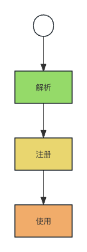
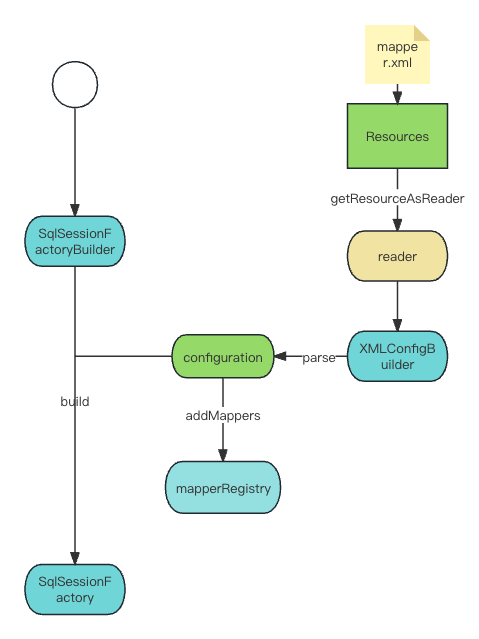
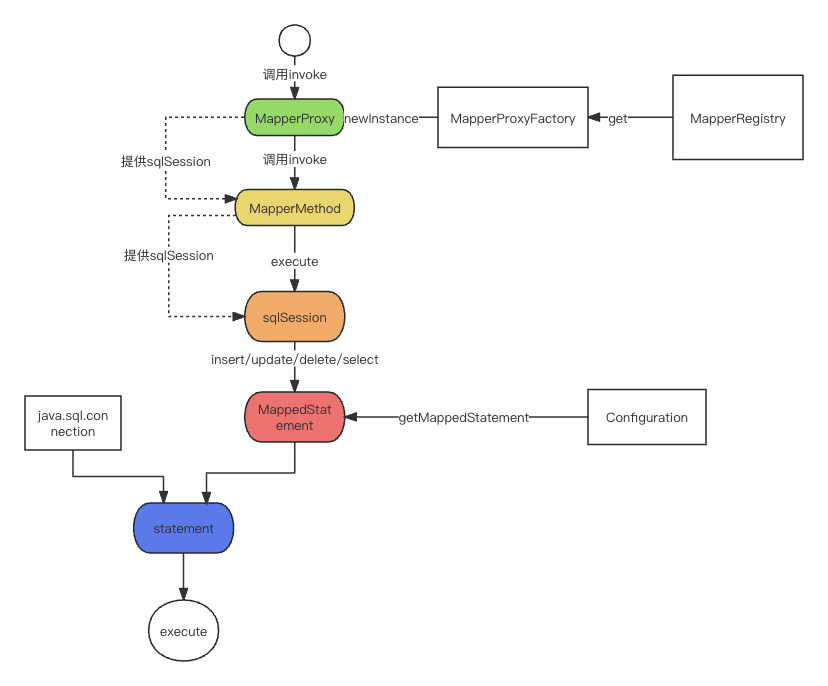

## 基础流程

首先我们需要从给定的配置文件路径中去解析出mapper与sql和对象的映射规则，然后需要创建好代理类。

然后我们需要将创建好的代理类注册到配置类中方便读取

使用的时候会根据调用的mapper获取对应的代理类去获得映射的sql

## 解析注册流程

首先是解析的步骤，系统会调用Resources类下的方法getResourceAsReader获取mapper.xml的读取类。

然后作为构造函数入参，去构造XmlConfigBuilder类，并调用parse()方法解析

解析时会去读取在xml中所定义的包路径地址，并调用MapperRegistry也就是mapper注册器的addMappers

注册器会去扫描包路径，将路径下的mapper生成对应的MapperProxyFactory并注册到注册器中

## 使用流程

整个过程实际上是基于代理的，spring注入的mapper对象是代理对象，每个mapper接口文件都有一个MapperProxyFactory,是在解析时候注册到MapperRegistry中的

Proxy中中包装了MapperMethod，执行invoke方法方法时会调用MapperMethod 的execute方法

每个MapperMethod记录了包装方法的类型，根据方法类型不同去调用不同的sqlSession方法（insert/update/delete/select等）

此时在sqlSession内部会根据configuration去获取MappedStatement(映射语句),并交由executor去执行一个不同的操作流程

基本上来说executor会先获取connect,并由connect和MappedStatement共同构建Statement,并执行Statement.execute();