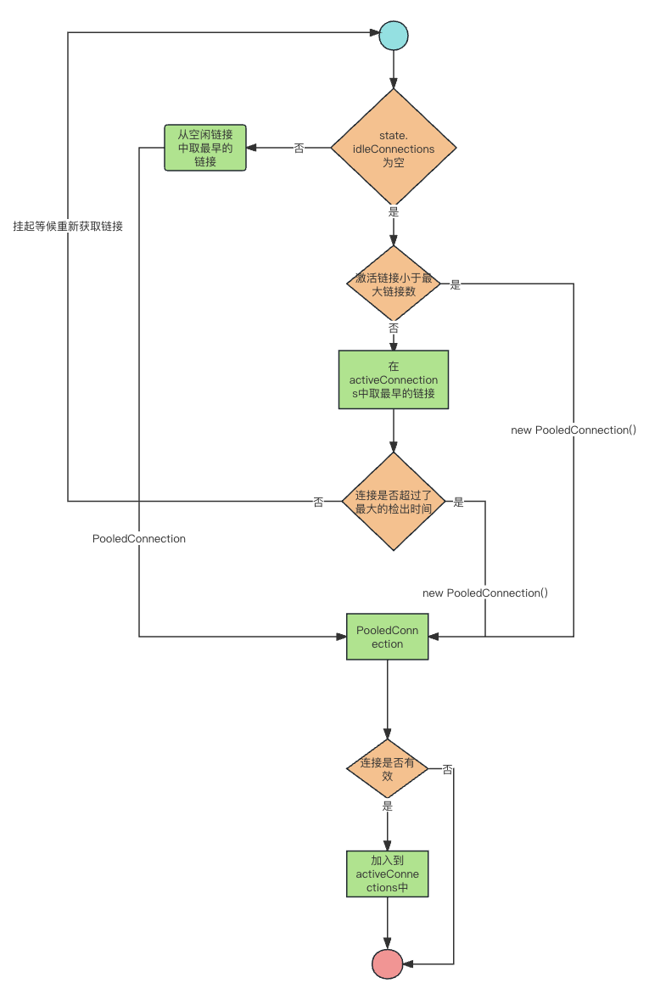

## 介绍
池化技术主要作用是为了对资源进行控制,在mybatis中就提供了PooledDataSource即池化数据源来对数据库连接进行控制

## 对象关系

PoolState主要作用是缓存池化连接(idleConnections和activeConnections)，数据源，并存储关于连接池相关的统计信息，例如请求次数，等待时间等。

PooledConnection对数据库连接对包装，存储了数据库连接，数据库代理连接，连接相关对统计状态等。

UnpooledDataSource存储了数据库连接相关配置（用户名、密码等）以及提供了获取数据库连接方法

PooledDataSource具备UnpooledDataSource 和 PoolState 以及一些池化配置，主要作用就是实现数据库连接的控制

## 数据库连接的控制流程
