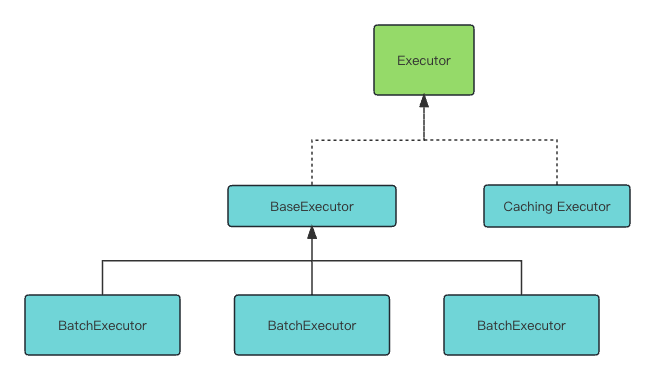

## 业务描述
mybatis中有很多地方利用模板方法来 兼顾共性 以及差异化，例如查询/更新等数据的调用

又例如statement声明处理器

简而言之，该模式可以让我们将公共的方法抽出，允许一部分的自定义，通常用于流程定制。

## 组成部分
1. 接口（用于定义标准方法，以及承接不同的实现类）
2. 抽象类父类(用来定义标准流程以及声明抽象方法用于给子类实现)
3. 子类（实现抽象父类定义的方法）
4. 选择器（可以是方法，可以是类，例如executor就是在Configuration中使用方法来进行区分，声明处理器则是专门用一个RoutingStatementHandler来做路由）