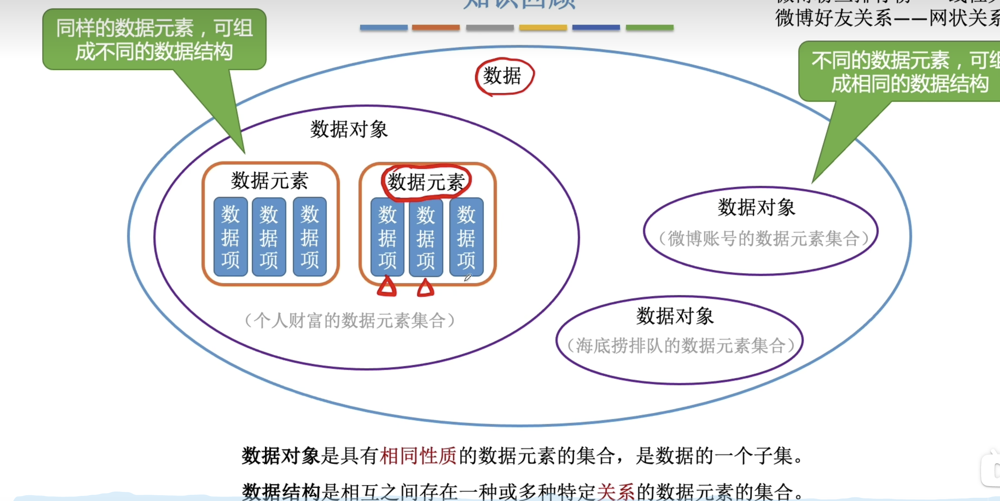

## 基本概念

数据是信息的载体，是描述观事物属性的数、字符及所有能输入到计算机中并被计算机程序识别和处理的符号的集合。数据是计算机程序加工的原料

### 数据项: 
    多个数据项组成数据元素，是数据元素的不可分割的最小单位。可类比于表属性
### 数据元素: 
    数据的基本单位，通常作为一个整体来考虑和处理。类比于表中的一条记录
### 数据对象
    具有相同性质的数据元素的集合叫数据对象，是数据的子集。类比于数据库表
#### 数据对象和数据结构的区别
    数据对象将相同性质的数据元素归类，侧重于相同性质。
    数据结构侧重于描述数据元素之间的关系，强调关系。不同的数据元素也可以有相同的数据结构。