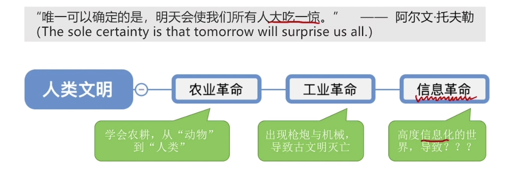
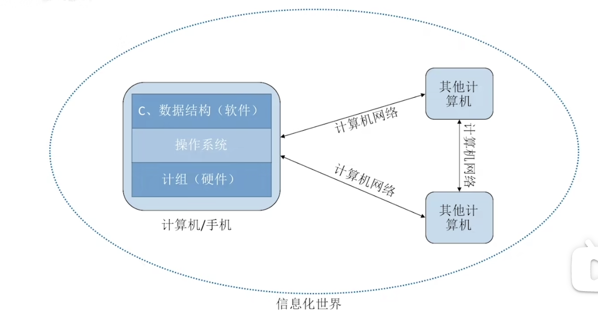

我们正处在信息革命中,通过对世界信息化数字化来给我们带来变革!

计算机就是信息革命的工具,信息革命的产物。

·计算机组成讲的是内存cpu等硬件，这是信息化的物质基础

·操作系统是建立在计算机硬件之上的系统方便人们操作以及软件运行

·计算机网络用来进行计算机之间的通信

·数据结构用来抽象现实世界，将问题对象或者实体对象抽象化，我们可以利用抽象出来的
对象编写程序，运行在操作系统之上

·编译原理则是高级语言与机器语言的桥梁，将高级语言翻译为机器语言，使机器按照我们
写好的程序运行。